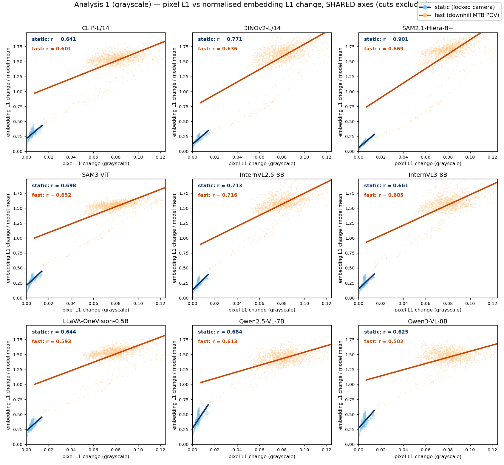
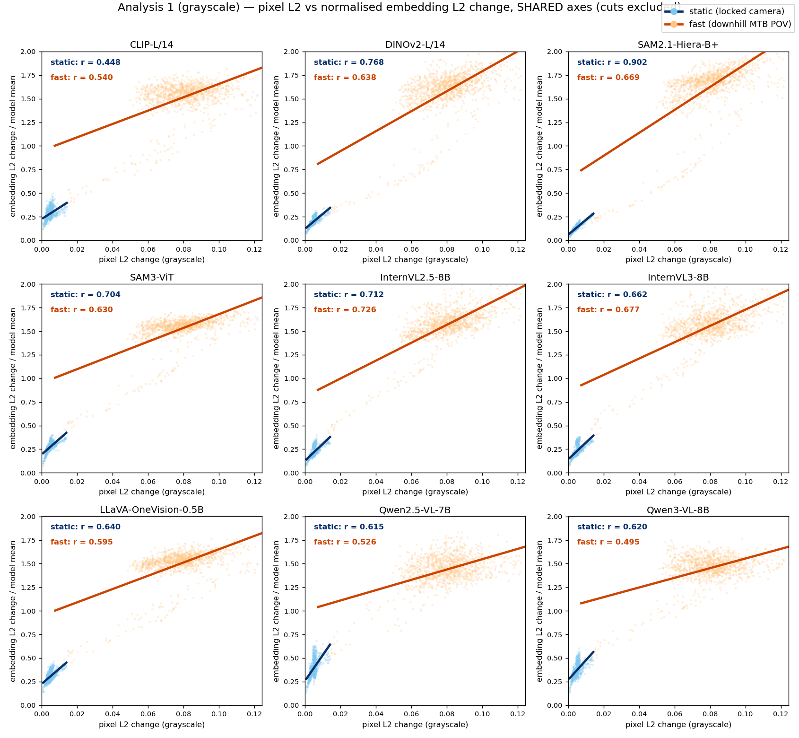

# Vision Encoder Temporal Redundancy Analysis

비디오를 LMM/VFM에 더 효율적으로 넣기 위한(인코더 출력 재사용·캐싱) 사전 분석.
인접 프레임(t vs t−1) 사이에서 **픽셀**과 **vision encoder 임베딩**이 얼마나 변하는지를
**L1 / L2 / cosine** 으로 측정하고, 9개 모델을 비교한다.

## 동기
비디오는 인접 프레임이 매우 비슷하다. 인코더 출력이 프레임 간 거의 변하지 않는다면
이전 프레임 결과를 재사용해 vision encoder 연산을 줄일 수 있다. 이 저장소는 그 **재사용
가능성**을 세 가지 분석으로 정량화한다.

- **분석 0** — 모델별 vision encoder 연산 시간(오버헤드)
- **분석 1** — 인접 프레임의 픽셀 변화와 인코딩 변화의 평균 비교 및 상관/민감도
- **분석 2** — 움직임이 큰 영역(상위 10% 픽셀 변화)에 인코딩 변화가 집중되는 정도(CF)

> **연구 가설(H3)**: 정적 패치의 encoder 출력을 재사용하는 cache-based vision encoding이
> 가능하다. 분석 1=시간축 근거(프레임 간 안정성), 분석 2=공간축 근거(움직임 영역 한정).
> 자세한 가설·설계는 **[ARCHITECTURE.md](ARCHITECTURE.md)** 참고.

## 핵심 결과 (분석 1, 회색조 공유축 오버레이)
세로축은 **임베딩 변화 ÷ 그 모델의 평균 임베딩 변화**로 정규화해(무차원), 임베딩 절대
크기가 수천 배씩 다른 9개 모델을 같은 축에서 비교한다. 가로축은 회색조 픽셀 변화(모든
모델 동일). `static`(파랑)은 원점 근처, `fast`(주황)는 넓게 퍼진다.

**L1 기준**


**L2 기준**


정적 영상에서 SAM2.1(r≈0.90)·DINOv2·InternVL 계열이 높은 상관을 보여, 작은 입력 변화가
표현에 충실히 전달된다. 또한 정적 패치는 인코딩 변화가 거의 없어(분석 2의 높은 집중도)
정적 영역 인코더 출력의 캐싱이 유망하다. **모델별 정량 수치(연산시간·상관 r·기울기·CF)는
[RESULTS.md](RESULTS.md)** 에, 서술형 리포트는 [results/REPORT.md](results/REPORT.md)에 있다.
패널별 자체 스케일(raw) 산점도는 `results/gray_analysis1_scatter_l{1,2}.png`.

## 실험 설정
- **영상 2종** (각 1분 이내, 854×480 → 448×448 통일)
  - `fast` — 다운힐 산악자전거 1인칭 시점(빠른 움직임), 45.0초
  - `static` — 고정 카메라 풍경(거의 정지), 32.7초
- **회색조 변환** — Rec.601 휘도 `Y = 0.299R + 0.587G + 0.114B` (cosine 대신 L1/L2 비교용,
  환경변수 `VDA_GRAY=1`로 켠다)

## 대상 모델 (9)
| 모델 | 종류 | conda env | 비전 인코더 측정 범위 | 연산시간 정적 (ms) |
|---|---|---|---|---|
| CLIP-L/14 | VFM | qwen3vl | 비전 타워 전체 (CLS 제외) | 9.6 |
| DINOv2-L/14 | VFM | qwen3vl | ViT-L/14 백본 전체 | 28.1 |
| SAM2.1-Hiera-B+ | VFM | sam2 | 이미지 인코더(Hiera+neck) | 102.6 |
| SAM3-ViT | VFM | sam3 | 이미지 모델 ViT trunk | 115.6 |
| InternVL2.5-8B | LMM | internvl | InternViT-300M | 20.8 |
| InternVL3-8B | LMM | internvl | InternViT-300M | 19.4 |
| LLaVA-OneVision-0.5B | LMM | qwen3vl | SigLIP-so400m/14 (−2층) | 17.4 |
| Qwen2.5-VL-7B | LMM | qwen3vl | 비전 ViT (merger 직전) | 52.9 |
| Qwen3-VL-8B | LMM | qwen3vl | 비전 ViT (merger 직전) | 23.8 |

## 평가 지표 (`common.py`)
프레임쌍(t−1, t)마다 픽셀과 임베딩을 같은 척도로 측정한다.
- **픽셀 변화**: 회색조 휘도 차이를 화면 전체 화소에 대해 평균. 회색조는 채널이 하나라 **L1 = L2**.
- **임베딩 변화 L1**: 패치 토큰 임베딩의 차원별 절대차 평균을 패치 전체에 대해 평균.
- **임베딩 변화 L2**: 두 임베딩 벡터의 유클리드 거리를 패치 전체에 대해 평균.
- 각 지표는 patch-grid heatmap과 스칼라(패치 평균) 둘 다 산출. cosine은 distance(1−cos)로 기록.

## Setup
이 코드는 **4개의 conda 환경**을 쓴다. 비전 모델마다 요구하는 `transformers` 버전이 달라
하나로 합치기 어렵다. 각 env에 `requirements.txt`의 공통 deps를 깔고 아래 표대로 맞춘다.

| env | 모델 | 핵심 의존성 |
|---|---|---|
| `qwen3vl` | CLIP, DINOv2, Qwen2.5-VL, Qwen3-VL, LLaVA-OV | `torch>=2.4`, `transformers>=4.57` |
| `internvl` | InternVL2.5 / InternVL3 | `transformers==4.37.2`, `trust_remote_code=True` |
| `sam2` | SAM2.1 | SAM2 소스(github.com/facebookresearch/sam2) + 체크포인트 |
| `sam3` | SAM3 | SAM3 이미지 모델 소스 + 체크포인트 |

**모델 가중치**: `bash dl_models.sh` (HF 7종 자동 다운로드). SAM2.1/SAM3는 소스 레포라
직접 받아 환경변수로 위치를 알려준다:
```bash
export SAM2_REPO=~/path/to/sam2     # SAM2_CKPT 로 체크포인트 따로 지정 가능
export SAM3_REPO=~/path/to/sam3
```
**영상 데이터**: `videos.json`의 `fast`/`static` 경로(기본 `videos/*.mp4`)에 1분 이내 클립을
둔다. `bash dl_videos.sh`로 샘플을 받을 수 있으나 **YouTube 검색 기반이라 매번 다른 영상이
받아진다**(완전 재현하려면 동일 클립을 직접 넣어야 함).

> 모든 스크립트 경로는 **스크립트 위치 기준**으로 동작한다(절대경로 하드코딩 없음). 출력
> 디렉터리만 `VDA_OUT_ROOT`로 덮어쓸 수 있다. `run_all*.sh`는 **GPU 4장**을 가정하므로 머신에
> 맞게 GPU 분배를 수정한다.

## 실행 / 재현
```bash
# 회색조(현재 기준) 전체 실행: 9개 모델 × 2영상, 4 GPU 분배
bash run_all_gray.sh           # 내부에서 VDA_GRAY=1 설정, out_gray/ 생성
python aggregate_gray.py       # out_gray/*/*/meta.json -> results/gray_summary.json
python gen_results_md.py       # -> RESULTS.md (정량표)
python plot_gray_overlay_shared.py   # -> results/gray_overlay_shared_l{1,2}.png

# 단일 모델만:  CUDA_VISIBLE_DEVICES=0 VDA_GRAY=1 python ext_clip.py
# RGB·cosine(레거시) 파이프라인:  bash run_all.sh  (out/ 생성)
```

## 새 모델 추가법
모든 모델이 동일한 `common.run_pipeline`을 공유하고, 모델별 파일은 **"한 프레임 → vision
encoder forward → 패치 토큰 (P, D)"** 부분만 정의한다. `ext_clip.py`가 가장 단순한 템플릿이다.
새 `ext_<model>.py`는:
1. 모델을 로드하고 전처리(해상도/정규화)를 정의한다.
2. 한 프레임을 받아 **공간 패치 토큰 `(P, D)`** 를 반환하는 forward 함수를 만든다
   (projector/merger **이전**의 ViT 패치 — 공간 위치가 1:1 대응되어야 분석 2가 성립).
3. `encoder=`, `model_type=` 등 메타 필드를 채워 `common.run_pipeline(...)`에 넘긴다.

추출 지점 선택 근거와 forward 인터페이스 계약은 **[ARCHITECTURE.md](ARCHITECTURE.md) §1** 참고.

## 알려진 한계 · 주의 (Known issues)
- **Qwen 측정 위치 아티팩트**: Qwen 계열은 merger(LayerNorm) **직전** 토큰을 뽑는데, 이 토큰은
  norm이 ~4,500으로 거대하고 프레임 간 거의 안 변하는 공통 성분이 방향을 지배한다. 그래서
  cosine은 변화가 작게(거의 0) 측정되고, L1/L2는 절대 크기가 다른 모델을 압도한다. **Qwen을
  공정 비교하려면 정규화(LayerNorm) 이후 지점에서 다시 측정**해야 한다.
- **cross-model L2/기울기 비교 금지**: 임베딩 절대 크기가 모델 간 ~6,000배 차이 난다. raw L2와
  OLS 기울기는 모델 간 직접 비교 불가. 공유축 오버레이는 **모델 평균으로 정규화**해 해결했고,
  cosine은 애초에 스케일 불변이다.
- **"움직임"은 optical flow가 아님**: 픽셀 차이 임계값(상위 10%) 기반 근사라, 카메라 노출/조명
  같은 전역 밝기 변화가 일부 섞일 수 있다.
- **두 파이프라인 공존**: `out/`(RGB·cosine, `run_all.sh`)는 레거시, `out_gray/`(회색조·L1/L2,
  `run_all_gray.sh`)가 현재 기준. `extract_qwen.py`/`extract_intern.py`는 더 오래된 2-모델
  caterpillar 프로토타입으로, 참고용으로만 남겨 둔다.
- **컷(장면 전환) 제외**: 픽셀-L2 시계열의 robust 임계(`median + 6·1.4826·MAD`) 초과 프레임을
  컷으로 보고 모든 평균에서 제외한다(빠른 영상 0개, 정적 영상 11개).

## 저장소 구조
```
common.py                    # 핵심 지표·파이프라인(픽셀/임베딩 L1·L2·cos, 컷 검출, 집중도)
ext_*.py                     # 모델별 임베딩 추출기 (clip/dinov2/sam2/sam3/intern/qwen25/qwen3/llava_ov)
run_all.sh / run_all_gray.sh # 9모델 × 2영상 전체 실행(4 GPU 분배). gray=현재 기준
aggregate_gray.py            # out_gray/ -> results/gray_summary.json
gen_results_md.py            # gray_summary.json -> RESULTS.md
plot_gray_overlay_shared.py  # 회색조 공유축 오버레이(위 그래프)
plot_gray_scatter.py         # 회색조 패널별 산점도
plot_analysis1_*.py          # RGB·cosine 산점도(레거시)
make_tables.py               # RGB 파이프라인 요약 표
dl_models.sh / dl_videos.sh  # 모델 가중치 / 샘플 영상 다운로드
results/                     # 그래프·요약(JSON)·리포트
ARCHITECTURE.md              # 가설·파이프라인 설계·추출 인터페이스 상세
RESULTS.md                   # 정량 결과표(자동 생성)
```
대용량 산출물(`out/`, `out_gray/`, `cache/`, `videos/`)은 `.gitignore`로 제외된다.

## 문서
- **[ARCHITECTURE.md](ARCHITECTURE.md)** — 연구 가설(H1/H2/H3), `common.run_pipeline` 설계, 추출 인터페이스
- **[RESULTS.md](RESULTS.md)** — 모델별 연산시간·상관·기울기·CF 정량표(자동 생성)
- **[results/REPORT.md](results/REPORT.md)** — 서술형 분석 리포트
